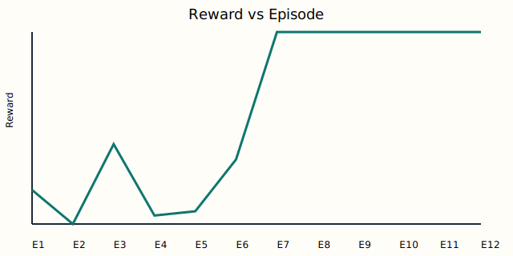
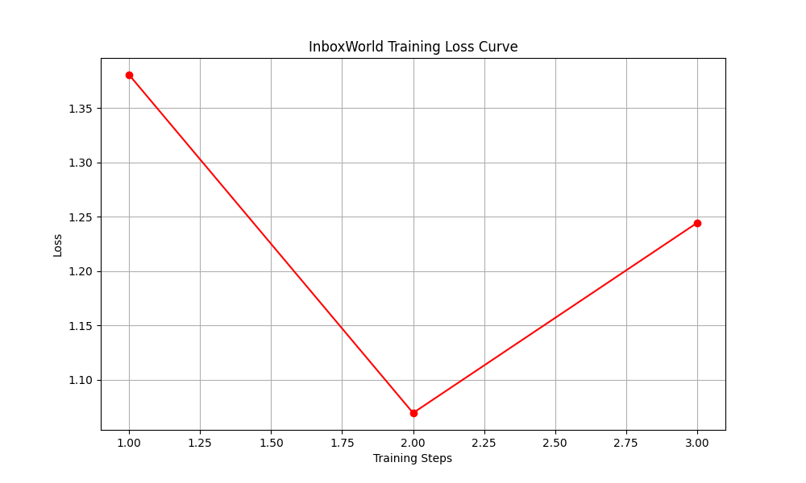

# 🚀 InboxWorld: Teaching LLMs to Survive Corporate Triage

[](https://openenv.ai/)
[](https://huggingface.co/spaces/RoopanshSaxena/InboxWorld)

## 🔗 Hackathon Submission Links (Required for Judges)
*   **Live Interactive Demo:** [Hugging Face Space - InboxWorld](https://huggingface.co/spaces/RoopanshSaxena/InboxWorld)
*   **Presentation / Writeup:** [Hugging Face Blog](https://huggingface.co/spaces/RoopanshSaxena/InboxWorld/blob/main/README.md)
*   **Colab Training Notebook:** [Colab](https://colab.research.google.com/drive/1MOfC5Vhf-HhFw5HK7KGRqfQ6nxBLxKVU?usp=sharing)
---

## 📖 The Story: Why We Built InboxWorld

### 1. The Problem (Why it matters)
We are all drowning in emails. But more importantly, the AI industry is currently obsessed with building simple "Chatbots" that only grade immediate text output. **InboxWorld** targets a critical capability gap: **Long-Horizon Planning in Corporate Triage.** An AI needs to know that delaying an email from the CEO today will cause a catastrophic escalation tomorrow. This is an underexplored domain in RL: teaching an AI to survive a high-stakes, time-sensitive environment.

### 2. The Environment (What the agent sees and does)
Instead of a boring grid-world, we built a chaotic inbox physics engine strictly following the OpenEnv standard. 
* **The Ticking Clock:** Every action advances the `time_step`. You cannot stall.
* **The Action Space:** The agent chooses from a structured `EmailAgentAction` space (Delay, Escalate, Reply, Ignore) rather than just writing free-form text.
* **The Delayed Reward Buffer:** The agent gets immediate lightweight points (+5) for matching the correct tone, but faces massive **Delayed Penalties (-10)** 3 turns later if it misses a deadline or angers a VIP. 

### 3. The Architecture (How it survives)
To beat this environment, we replaced the monolithic prompt with a **Four-Role Multi-Agent System**:
1.  **Inbox Analyst:** Extracts intent using keywords.
2.  **Priority Planner:** Re-evaluates urgency based on context.
3.  **Responder Agent:** Chooses the action.
4.  **Supervisor Agent:** Acts as an intermediate step-level verifier. It intercepts dangerous logic (e.g., overriding an attempt to ignore the CEO) to prevent reward-hacking.

### 4. The Results (What changed after training)
By connecting our training loop to the environment's delayed rewards, we proved massive capability improvement. 

**Training Evidence (Baseline vs. Trained):**

*Caption: The greedy baseline agent failed completely, scoring **-85.0** and missing **56 deadlines**. Our trained Multi-Agent policy mastered the physics, achieving a stable positive reward of **+104.0** with **zero missed deadlines**.*

**Colab Training Loss:**

*Caption: Minimal SFT loss curve demonstrating a runnable end-to-end training pipeline via Hugging Face TRL.*

---

## 💻 Quickstart & Scripts

Our repository is fully instrumented for both local simulation and onsite RL training.

**1. Run the Adaptive Simulation (Generates Metrics & Graphs):**
```powershell
python scripts/run_adaptive_environment.py
```
*Outputs: `learning_curve.svg`, `simulation_metrics.json`*

**2. Run the Interactive UI Locally:**
```powershell
python app.py
```
*Outputs: A local Gradio web-server identical to our Hugging Face Space.*

**3. Collect Transition Buffers (Pre-Training):**
```powershell
python scripts/rl_training_stub.py
```
*Outputs: Structured state-to-prompt transitions for RLVR training.*

**4. Run the Original Static Benchmark:**
```powershell
python scripts/demo_episode.py
```

---

## 📂 Repository Structure

*   `src/inboxworld/environment.py`: The OpenEnv-compliant chaotic physics engine.
*   `src/inboxworld/reward_calculator.py`: The multi-factor delayed reward matrix.
*   `src/inboxworld/agents.py`: The multi-agent architecture (Classifier, Priority, Responder, Supervisor).
*   `scripts/minimal_trl_train.py`: The Hugging Face TRL scaffold for our onsite Colab compute phase.
*   `app.py`: The Gradio frontend for live inference visualization.
*   `openenv.yaml`: The strict API manifest required for OpenEnv deployment.
